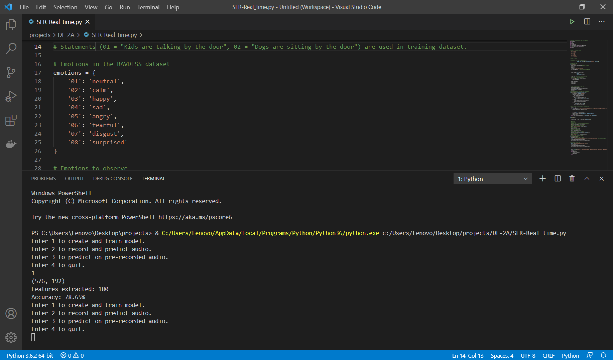

# ВОКАМОДЖИ - распознавание эмоций

## Что это?

Решение для распознавания эмоций по аудио,
адаптировано с другого репозитория для работы как сервис на FASTAPI

## Что это дает?
- FastAPI сервис для простого развертывания 
- Впоследствии этот сервис легко упаковать в Docker
- Автодокументация по /docs с помощью OpenAPI
- Возможность выборку, на которой производится обучение модели

## А че крутое в общих чертах? 
- Распознает эмоции для *всех* языков
- Легко расширяется (добавлением тренировочного материала с новыми лейблами)
- Изолированный сервис по распознаванию, который легко горизонтально масштабировать

## Пример работы сервиса fastAPI в серверном режиме


## Для тестирования модели можно запустить распознавание отдельно следующим образом:

```bash
python3 SER_RT.py
```



### Note
If the program is run for the first time then select option first compulsorily to create and train model otherwise no predictions will be given.

### Paper Link оригинальной статьи
<a href="https://www.irjet.net/archives/V8/i6/IRJET-V8I6496.pdf"> Published Paper </a>

## Стек
- FastAPI
- Sklearn
- librosa
- pyaudio

## Команда - ЧУПАПИБАМБОНИ
- Татьяна Лебедева - Flutter разработчик
- Сергей Свириденко - Backend разработчик
- Тампио Илья - ML-разработчик и менеджер


